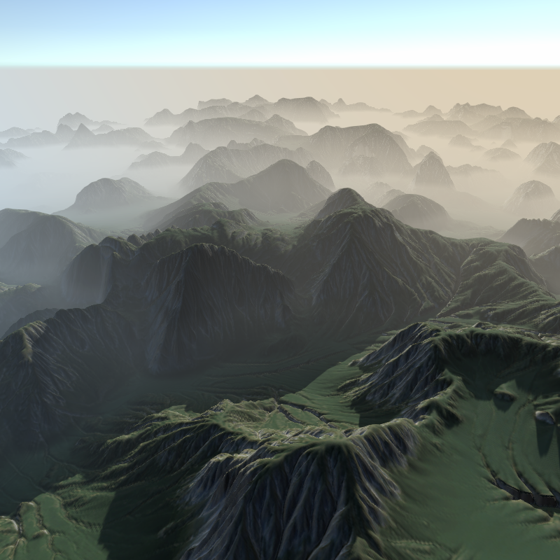

# UnityURPAtmosphericFog
AtmosphericFog for Urp pipeline using Shader Graph

https://youtu.be/_0VDW6RKSkQ

## How use:
Enable Depth Texture in your settings

Add AtmosphericFogRenderFeature in your urp Asset_Renderer and fun with the parameters

## References:

  https://samdriver.xyz/article/scriptable-render
  
  https://www.cyanilux.com/tutorials/depth/
